<p align="center">
  
</p>

<h1 align="center">Sitewright</h1>

<p align="center">
  <a href="launch/brag-output/brag.mp4">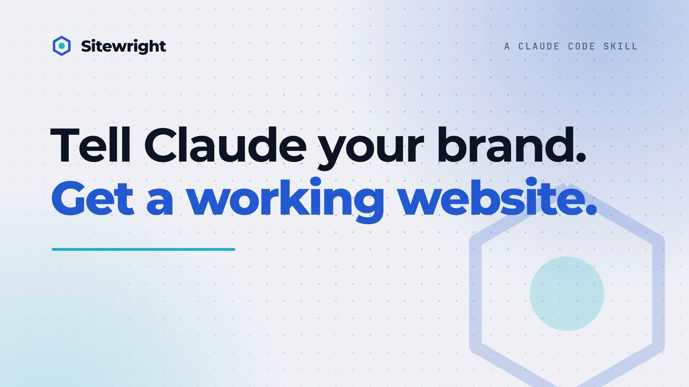</a><br>
  <sub><b>Watch the 22-second launch video</b> (<a href="launch/README.md">how it was made</a>)</sub>
</p>

<p align="center">
  <b>A Claude Code skill that builds your website.</b><br>
  Landing page, sign-in, authenticator MFA, records dashboard, release publishing and a connect-your-phone page,<br>
  restyled with your brand, wired to a real backend, and tested in a real browser.
</p>

<p align="center">
  <a href="https://sitewright-skill.vercel.app"><b>Live site</b></a> &nbsp;·&nbsp;
  <a href="#install">Install</a> &nbsp;·&nbsp;
  <a href="#what-it-makes">Screenshots</a> &nbsp;·&nbsp;
  <a href="#modules">Modules</a> &nbsp;·&nbsp;
  <a href="#examples">Examples</a> &nbsp;·&nbsp;
  <a href="#how-it-is-tested">Tests</a>
</p>

<p align="center">
  
  
  
  
</p>

---

## What it does

You tell Claude which pieces you want and describe your brand. Sitewright writes a complete [Next.js 15](https://nextjs.org) project: pages, API routes, database schema, file storage, middleware and a README. Your colours, your words, your data. It then builds the project and drives it in Chromium at desktop and phone sizes, and tells you exactly what passed.

```text
you     Use Sitewright to make a landing page, a dashboard and a connect page
        for my coffee roastery, Bean & Barrel.

claude  Which modules do you want?
        [x] Landing page    [ ] Publishing page    [x] Dashboard
        [x] Connect to phone    [x] Sign in    [ ] MFA accounts
        ...
```

The output is an ordinary project that you own. It has no runtime dependency on this skill.

## What it makes

Everything below was generated from a short JSON config, built, and exercised in a browser. The brands, names, prices and photos are fictional demo data.

<table>
  <tr>
    <td width="50%"><br><sub><b>Landing page</b> · animated mark, QR download card, story, FAQ</sub></td>
    <td width="50%"><br><sub><b>Dashboard</b> · stat cards, status chips, search, facet filters, record cards</sub></td>
  </tr>
  <tr>
    <td><br><sub><b>Scroll story</b> · a phone mock-up that changes with each step</sub></td>
    <td><br><sub><b>Record detail</b> · facts, files, line items, one-click status changes</sub></td>
  </tr>
  <tr>
    <td><br><sub><b>Publishing</b> · drop a file, write notes, pick stable or testing</sub></td>
    <td><br><sub><b>MFA</b> · authenticator-app enrolment, invites, lockout, activity log</sub></td>
  </tr>
</table>

### On a phone

Every page is checked at 390 px and 360 px wide: no sideways scrolling, tables that scroll inside their card, filters in one swipeable row, controls at least 44 px tall on touch screens.

<p align="center">
  
  
  
  
</p>

### Light and dark

Give it a primary and an accent colour. It derives the washes, the text colours (contrast-checked) and a lighter dark-mode variant. Dark follows the device, with a toggle in every header.

<p align="center">
  
  
</p>

### One kit, any brand

<table>
  <tr>
    <td width="33%"><br><sub><b>Halden Legal</b> · matters, fees, stages</sub></td>
    <td width="33%"><br><sub><b>Sunny Side Bakery</b> · a near-white brand colour, kept readable</sub></td>
    <td width="33%"><br><sub><b>Pixel Studio</b> · landing page + MFA team area</sub></td>
  </tr>
</table>

## Modules

Pick any combination. Dependencies are added for you (`publishing` brings `mfa`; `dashboard` and `connect` bring `signin` and the ingest API).

| Module | What you get | Needs |
| --- | --- | --- |
| `landing` | Public home page: animated mark, scroll story with phone mock-ups, proof numbers, features, FAQ, download card with QR code and team code, release list | none |
| `signin` | Shared-password gate in front of private pages: signed cookie, constant-time compare, safe `?next=` redirect, edge middleware | none |
| `mfa` | Named accounts with password and authenticator-app codes (TOTP), first-run setup, single-use invites, lockout, activity log | none |
| `publishing` | Upload versions, rich release notes, stable/testing channels, testers with codes, update-check endpoint, public download. Real APK parsing, or any file types you list | `mfa` |
| `dashboard` | Stat cards, filters, search, record cards, detail page with files, line items and status actions | `signin`, `api` |
| `connect` | A page with the link (address + key) to paste into your app, a copy button and a `curl` example | `signin`, `api` |
| `fxgallery` | A public `/effects` page: every animated effect live on a sample hero, a colour picker, and the config to copy | none |

Internally there are two more: `base` (design system, database, storage) and `api` (ingest, signed uploads, file serving, health), added automatically when needed.

## Effects (optional)

Add motion without adding a library. Ask for one in plain words ("use aurora behind the hero") and Claude builds it into the site; or let Claude pick a fitting preset. `scaffold.mjs --list-effects` prints the whole menu, and the generated site gets only what was chosen. Change your mind later and it takes a second, without touching anything you edited: `scaffold.mjs --apply-effects ./my-site --hero-bg stars`. **10 animated hero backgrounds**, **8 headline text animations**, **4 button** and **4 card** micro-interactions, **5 scroll-reveal styles** and **4 extras** (cursor glow, scroll progress, click sparks, count-up numbers). Seven presets bundle sensible combinations: `calm`, `aurora-glass`, `tech-grid`, `playful`, `cosmic`, `editorial`, `minimal`.

<table>
  <tr>
    <td width="20%">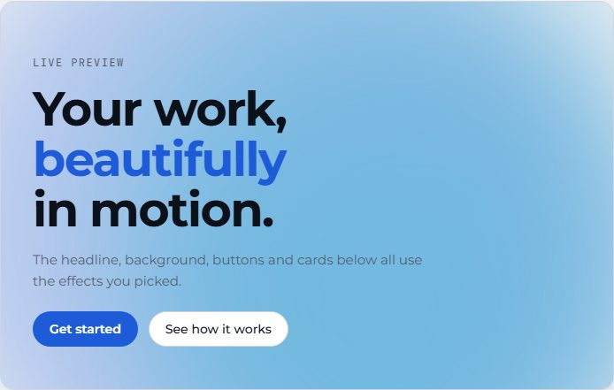<br><sub><b>Aurora</b></sub></td>
    <td width="20%">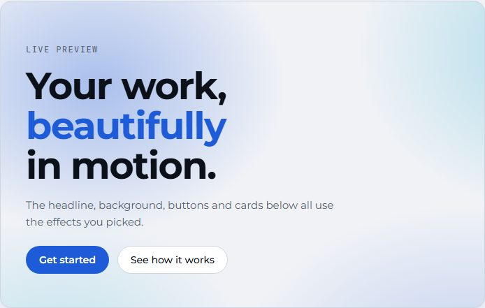<br><sub><b>Gradient mesh</b></sub></td>
    <td width="20%">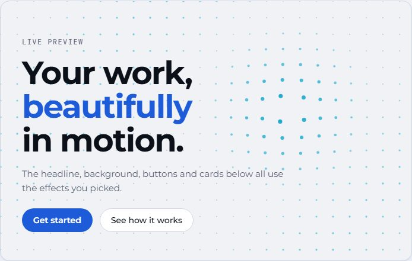<br><sub><b>Dot grid</b></sub></td>
    <td width="20%"><br><sub><b>Particles</b></sub></td>
    <td width="20%"><br><sub><b>Starfield</b></sub></td>
  </tr>
  <tr>
    <td width="20%">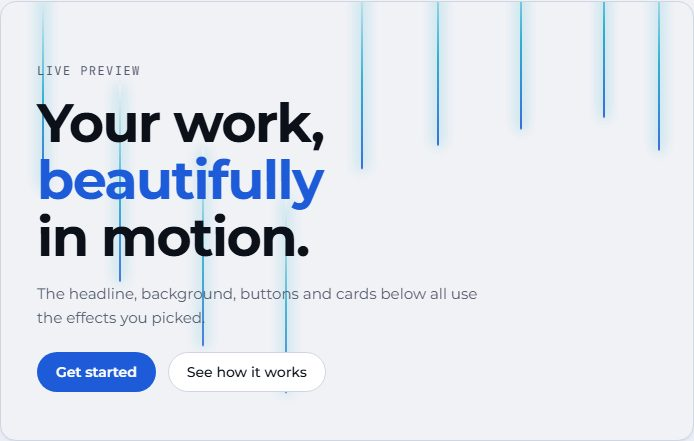<br><sub><b>Light beams</b></sub></td>
    <td width="20%">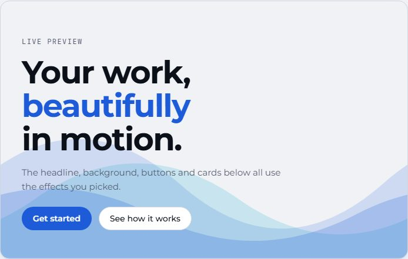<br><sub><b>Waves</b></sub></td>
    <td width="20%">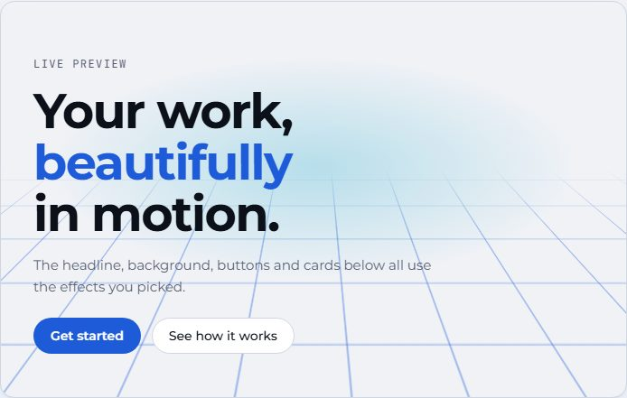<br><sub><b>Perspective grid</b></sub></td>
    <td width="20%">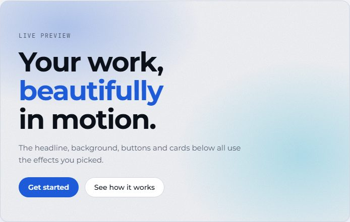<br><sub><b>Grain gradient</b></sub></td>
    <td width="20%">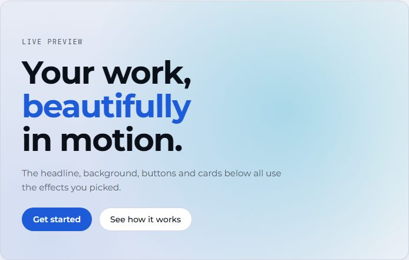<br><sub><b>Spotlight</b></sub></td>
  </tr>
</table>

**[Try every effect live](https://sitewright-skill.vercel.app/demo/effects/)**: pick a combination, change the brand colours, and copy the exact config. The same page can be generated for your own site with the `fxgallery` module.

```jsonc
"effects": {
  "preset": "aurora-glass",
  "heroBackground": "aurora",
  "headline": "split-words",
  "buttons": "glow-border",
  "cards": "spotlight",
  "reveal": "blur",
  "extras": ["cursor-glow", "count-up"]
}
```

The backgrounds, headline animations and micro-interactions are original, dependency-free code (no GSAP or Three.js). It honours `prefers-reduced-motion`, skips pointer-follow effects on touch screens, pauses canvases that are off screen, and keeps the real headline text for screen readers. See [`reference/effects.md`](skill/sitewright/reference/effects.md) for the full catalogue.

### Icons

Say `icons: "auto"` and the navigation, stat cards, status chips, features list and story steps get icons where a title clearly names one (an order is a box, a delivery a truck, a warning a triangle); or name them yourself. They are inline SVG from the open sets behind [Iconify](https://iconify.design) (200,000+ icons in 150+ sets; [better-icons](https://github.com/better-auth/better-icons) is the tool that finds them), in the colour of the text around them, and a site carries only the ones it uses: no icon font, no library, no request at run time.

In your own pages there is nothing to set up. Write the icon where you want it, and the project brings it in by itself (while `npm run dev` runs, and before every build):

```tsx
<Icon name="rocket" />          // 120 of these on a page are found and added in a fraction of a second
<Icon name="tabler:home" />     // any other set
<Icon for="Shipped orders" />   // or describe it, and the fitting icon is chosen
```

Your own words are set once and apply everywhere (`"icons": { "map": { "roast": "coffee" } }`). A typo is reported with the file and a suggestion. For the places the generator fills (navigation, stat cards, chips...), `icons: auto` or:

```bash
node scaffold.mjs --config site.json --out ./my-site --icons auto
node scaffold.mjs --apply-icons ./my-site --icon stats.0=package       # change one later, in a second
```

Each set keeps its licence (written into the site's `icons/NOTICE.md`; a CC BY set also gets a ready-made credit line, and a licence that is not for products is refused). Every icon is rebuilt from an allow-list of drawing elements before it is written, so icon data from the network cannot add a script to your pages. Details, places and licences: [`reference/icons.md`](skill/sitewright/reference/icons.md).

### Figures: little drawings that answer the pointer

22 small isometric line figures, placed where they mean something. Say `figures: "auto"` and every place the site has gets its fitting figure, or choose them one by one:

<table>
  <tr>
    <td width="33%"><br><sub><b>Padlock</b> · the sign-in card. The shackle lifts as you reach</sub></td>
    <td width="33%">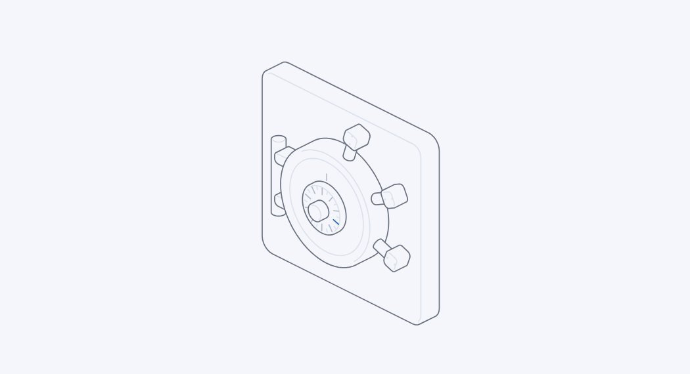<br><sub><b>Vault</b> · account sign-in. Turn the dial, the bolts draw back</sub></td>
    <td width="33%">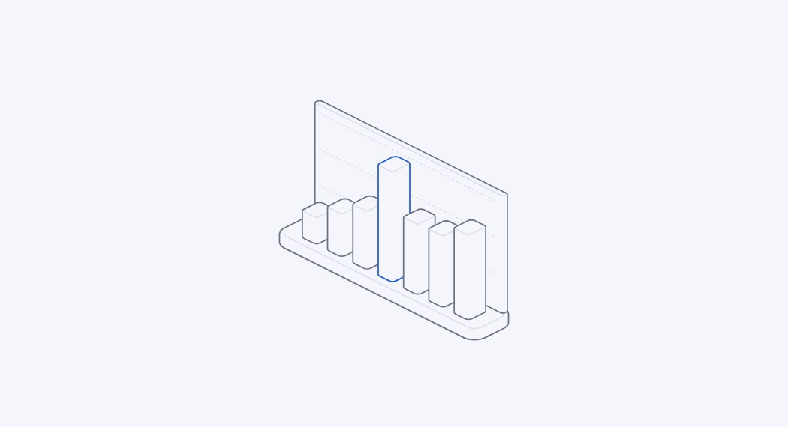<br><sub><b>Bars</b> (new) · an empty dashboard. The bar under you climbs</sub></td>
  </tr>
  <tr>
    <td>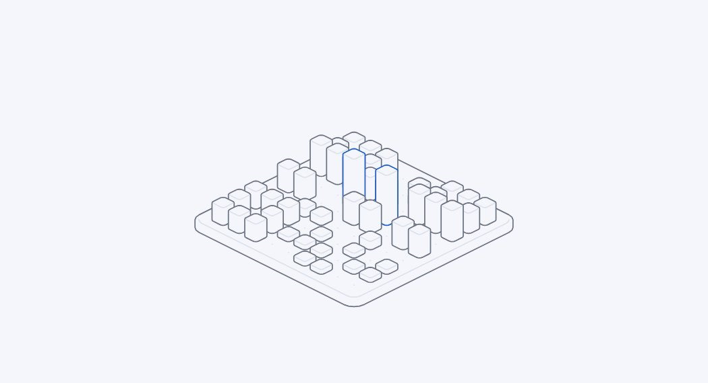<br><sub><b>Scanner</b> (new) · the connect page. A scan line follows you</sub></td>
    <td>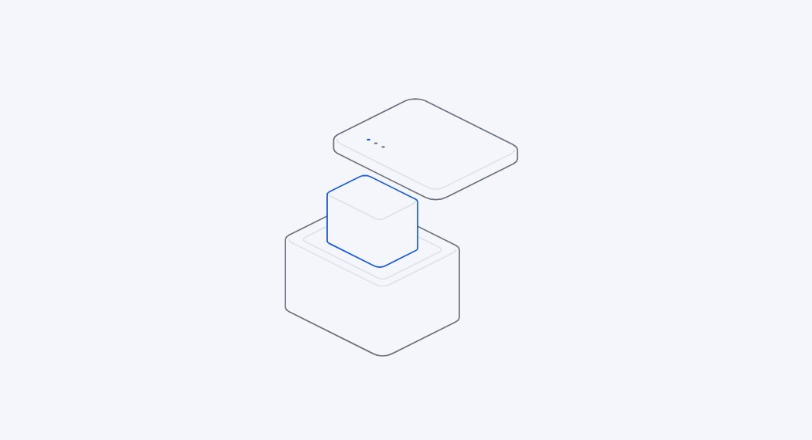<br><sub><b>Parcel</b> (new) · beside the releases. Move up and it opens</sub></td>
    <td>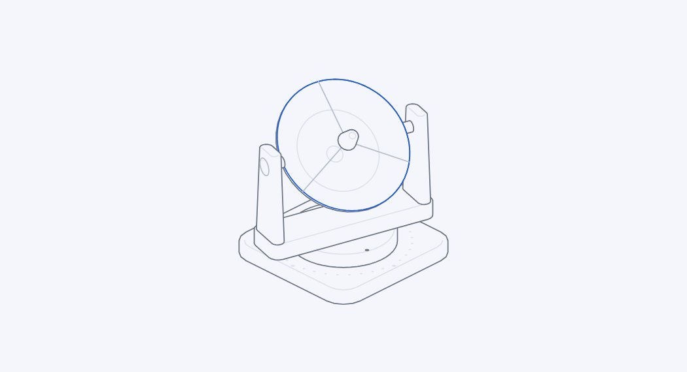<br><sub><b>Dish</b> · the 404 page. It looks for a signal</sub></td>
  </tr>
</table>

| Place | Where | `auto` puts |
| --- | --- | --- |
| `hero` | beside the landing headline | `exploded` |
| `releases` | beside the "what's new" list | `parcel` |
| `signin` | the shared-password card | `padlock` |
| `mfa` | every account sign-in step | `vault` |
| `connect` | the "connect a phone" page | `scanner` |
| `empty` | an empty list, or a search that finds nothing | `bars` |
| `notfound` | the 404 page | `dish` |

```bash
node scaffold.mjs --config site.json --out ./my-site --figures auto
node scaffold.mjs --apply-effects ./my-site --figures hero=bars        # change one place later, in a second
```

They wear your brand colours and follow light and dark mode, answer touch as well as a mouse, hold still under reduced motion, and ship only the figures you chose. **Nineteen are [Hairline](https://github.com/lucasmarkes/hairline) by Lucas Marques (MIT, its licence travels with the files); `bars`, `scanner` and `parcel` are new here**, drawn on the same engine to Hairline's ten rules. Which figure fits where, and how to add your own: [`reference/figures.md`](skill/sitewright/reference/figures.md).

> The idea comes from animated-component libraries such as [React Bits](https://reactbits.dev). Their licence (MIT with the Commons Clause) does not allow redistributing the components inside another package, so these effects are written from scratch for this kit.

## Install

You need [Claude Code](https://claude.com/claude-code) and Node.js 20 or newer. A skill is a folder that Claude Code reads when a session starts, so installing means copying one folder.

### macOS / Linux

```bash
git clone https://github.com/raj742133/sitewright
cd sitewright
./install.sh
```

### Windows (PowerShell)

```powershell
git clone https://github.com/raj742133/sitewright
cd sitewright
.\install.ps1
```

If PowerShell blocks the script: `powershell -ExecutionPolicy Bypass -File .\install.ps1`

### Only for one project

Installs into `.claude/skills/` of the current folder, so you can commit it and share it with your team.

```bash
cd your-project
/path/to/sitewright/install.sh --project          # macOS / Linux
C:\path\to\sitewright\install.ps1 -Project         # Windows
```

### Manual

```bash
mkdir -p ~/.claude/skills
cp -R sitewright/skill/sitewright ~/.claude/skills/
```

On Windows the target is `%USERPROFILE%\.claude\skills\sitewright`.

### Browser tests (once)

The verification step uses Playwright. Install it wherever you will run the verifier:

```bash
npm i playwright
npx playwright install chromium
```

### Check that it worked

- `~/.claude/skills/sitewright/SKILL.md` exists.
- Start a **new** Claude Code session and type `/sitewright`. The skill should appear in the list.

## Use it

Ask in plain words:

> Use Sitewright to make a landing page and a dashboard for my business.

> I need a publishing page where my team uploads releases, with MFA sign-in.

> Give the landing page an aurora background and a split-words headline.

> /sitewright

Claude will ask which modules you want, then your brand name, two colours, logo style and what you call things (orders, cases, scans), and whether you want an animated style (a preset, piece by piece, or a look at the live gallery first). It writes a `site.json`, runs the generator, installs, builds, and runs the verifier. It reports what passed and what it could not check.

### Without Claude

The generator is plain Node. Even a brand name is enough:

```bash
echo '{"brand":{"name":"Acme Co"}}' > site.json
node ~/.claude/skills/sitewright/scripts/scaffold.mjs --config site.json --out ./my-site
cd my-site && npm install && npx next build && npm start
```

The generator prints the development password and ingest key it created (they are also in `.env.local`).

Then verify it:

```bash
node ~/.claude/skills/sitewright/scripts/verify.mjs --site ./my-site --port 4010 --out ./verify-shots
```

## Examples

Seven complete configs ship in [`skill/sitewright/examples`](skill/sitewright/examples):

| Config | Brand | Modules | Shows |
| --- | --- | --- | --- |
| [`coffee.json`](skill/sitewright/examples/coffee.json) | Bean & Barrel | all six | PDF/ZIP publishing, testers, every landing section |
| [`fitness.json`](skill/sitewright/examples/fitness.json) | PulseFit | all six | Android APK publishing with real manifest parsing |
| [`legal.json`](skill/sitewright/examples/legal.json) | Halden Legal | landing, sign-in, dashboard, connect | monogram logo, navy and gold, "matters" vocabulary |
| [`studio.json`](skill/sitewright/examples/studio.json) | Pixel Studio | landing, MFA | square logo, purple and cyan |
| [`minimal.json`](skill/sitewright/examples/minimal.json) | Acme Co | defaults | a brand name and nothing else |
| [`coffee-effects.json`](skill/sitewright/examples/coffee-effects.json) | Bean & Barrel | all six | `coffee.json` plus an `effects` block (aurora-glass preset, beams on the sign-in page, line figures in six places) |
| [`gallery.json`](skill/sitewright/examples/gallery.json) | Effect Lab | `fxgallery` | just the live effects gallery |

The full list of config keys is in [`reference/config.md`](skill/sitewright/reference/config.md).

## What you get under the hood

- **Layered sign-in.** A shared-password cookie, named MFA accounts, a bearer ingest token and per-tester codes. They are four separate layers and are never merged.
- **Direct-to-storage uploads.** Clients get short-lived signed URLs and PUT files straight to storage. Local disk, S3 / R2 or Azure Blob.
- **Idempotent ingest.** Re-sending a record id updates it instead of duplicating it, so a phone that retries after losing signal does no harm.
- **Postgres with zero setup.** Embedded Postgres ([PGlite](https://pglite.dev)) out of the box; set `DATABASE_URL` for production.
- **Secure defaults.** Scrypt password hashes, HMAC-signed cookies, constant-time compares, authenticator codes that cannot be reused, lockout after five failures, user text sanitised before it reaches source files.
- **Your vocabulary.** Call a record an order, a matter or a loaf, and every label, heading and empty state follows.
- **No invented facts.** Sections that need real numbers (proof, features, compatibility) stay off until you supply them.

## How it is tested

Each example was scaffolded from its config, type-checked, built for production and driven with Playwright in Chromium at 1280, 390 and 360 px. Checks include sign-in and open-redirect refusal, full MFA enrolment with an independent TOTP implementation, replay refusal, single-use invites, publishing with build-number ordering and byte-identical downloads, ingest auth and idempotency, filters, no horizontal scroll, finger-sized controls, repeated warm-cache loads of every page type for hydration errors, and console errors. For the effects it also checks that headline text stays readable to assistive technology, that canvas backgrounds stop drawing when scrolled off screen, that reduced-motion shows the final state, and that touch screens skip hover effects.

| Site | What it exercises | Result |
| --- | --- | --- |
| Bean & Barrel | all six modules, PDF/ZIP publishing, testers | 87/87 |
| PulseFit | all six modules, two real Android APKs parsed and published | 77/77 |
| Halden Legal | landing, sign-in, dashboard, connect; monogram logo, navy and gold | 60/60 |
| Pixel Studio | landing and MFA only | 34/34 |
| Sunny Side Bakery | near-white brand colours (contrast adjustment) | 49/49 |
| Midnight Courier | near-black brand colours, other fonts, PDF/CSV publishing | 45/45 |
| Quotes, tags, braces | a brand name full of `"`, `<b>`, `{x}`, backticks and a backslash | 57/57 |
| Orbit Labs | a single module: landing only | 12/12 |
| Field Notes Press | a single module: publishing only (brings MFA and the API) | 24/24 |
| Acme Co | just a brand name, everything else defaulted | 75/75 |
| Bean & Barrel + effects | aurora-glass preset, beams behind the sign-in card, cursor glow, scroll progress, count-up | 102/102 |
| Play House | particles, split letters, ripple buttons, tilt cards, click sparks, stars on sign-in | 70/70 |
| Ripple Works | waves, rotating headline word, magnetic buttons, glow-border cards, slide reveal | 36/36 |
| Grid Labs | tech-grid preset: perspective grid, decode headline, spotlight cards | 60/60 |
| Effect Lab | the live effects gallery: every background, headline, button, card, reveal and extra | 9/9 |

Fifteen sites, 797 checks, all passing on the final templates.

Details of every check are in [`reference/testing.md`](skill/sitewright/reference/testing.md).

### Not covered

- `next dev` crashed with PGlite on the Node versions tried (24.18 and 22.23), so only production builds are tested.
- Real phones, Safari, Firefox and tablets. Only Chromium at three widths.
- S3 and Azure storage against a real bucket, and a real Postgres server.
- Brand names longer than about 24 characters in the phone header.
- The authentication code follows common practice but has not had an independent security audit. Review it before putting anything sensitive behind it.

## Repository layout

```text
skill/sitewright/      the skill: SKILL.md, scripts, templates, examples, reference docs
  scripts/             scaffold.mjs (generator), verify.mjs (browser verifier), effects.mjs, modules.mjs, defaults.mjs
  templates/           base + one folder per module, mirroring the generated project
  templates/fx/        the effects: backgrounds, headline animations, micro-interactions, css
  examples/            seven complete configs
  reference/           config keys, modules, design system, effects, testing, gotchas
site/                  the website (static HTML/CSS/JS) plus demo/, the exported live effects gallery; deployed on Vercel
launch/                the launch video (mp4, poster, plan) and the Hyperframes project that renders it
tools/                 how the screenshots, banner and social image were made
install.sh, install.ps1
```

To regenerate the screenshots: build the example sites, then run `tools/showcase.mjs` for each (see the header of that file).

## Contributing

Issues and pull requests are welcome. A new module is a folder under `skill/sitewright/templates/modules/<id>/` that mirrors the output tree, plus an entry in `scripts/modules.mjs`. Please run the verifier on at least one generated site before opening a pull request, and say which sites you ran.

## Licence

[MIT](LICENSE)
