<p align="center">
  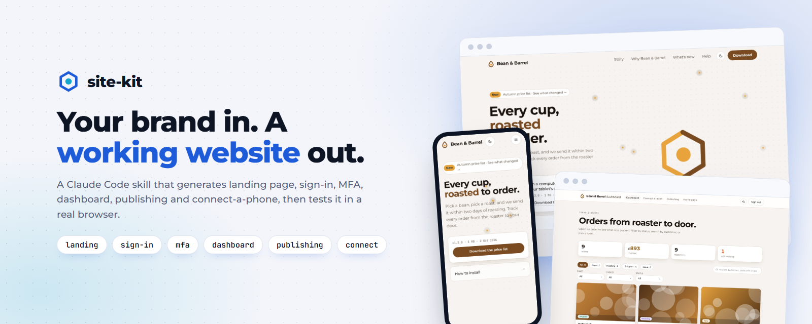
</p>

<h1 align="center">site-kit</h1>

<p align="center">
  <b>A Claude Code skill that builds your website.</b><br>
  Landing page, sign-in, authenticator MFA, records dashboard, release publishing and a connect-your-phone page,<br>
  restyled with your brand, wired to a real backend, and tested in a real browser.
</p>

<p align="center">
  <a href="https://__LIVE_URL__"><b>Live site</b></a> &nbsp;·&nbsp;
  <a href="#install">Install</a> &nbsp;·&nbsp;
  <a href="#what-it-makes">Screenshots</a> &nbsp;·&nbsp;
  <a href="#modules">Modules</a> &nbsp;·&nbsp;
  <a href="#examples">Examples</a> &nbsp;·&nbsp;
  <a href="#how-it-is-tested">Tests</a>
</p>

<p align="center">
  
  
  
  
</p>

---

## What it does

You tell Claude which pieces you want and describe your brand. site-kit writes a complete [Next.js 15](https://nextjs.org) project: pages, API routes, database schema, file storage, middleware and a README. Your colours, your words, your data. It then builds the project and drives it in Chromium at desktop and phone sizes, and tells you exactly what passed.

```text
you     Use site-kit to make a landing page, a dashboard and a connect page
        for my coffee roastery, Bean & Barrel.

claude  Which modules do you want?
        [x] Landing page    [ ] Publishing page    [x] Dashboard
        [x] Connect to phone    [x] Sign in    [ ] MFA accounts
        ...
```

The output is an ordinary project that you own. It has no runtime dependency on this skill.

## What it makes

Everything below was generated from a short JSON config, built, and exercised in a browser. The brands, names, prices and photos are fictional demo data.

<table>
  <tr>
    <td width="50%">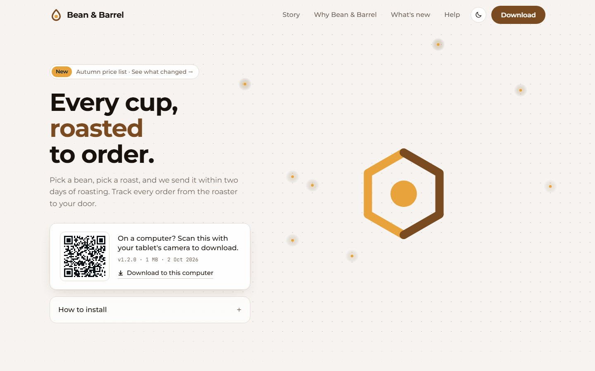<br><sub><b>Landing page</b> · animated mark, QR download card, story, FAQ</sub></td>
    <td width="50%">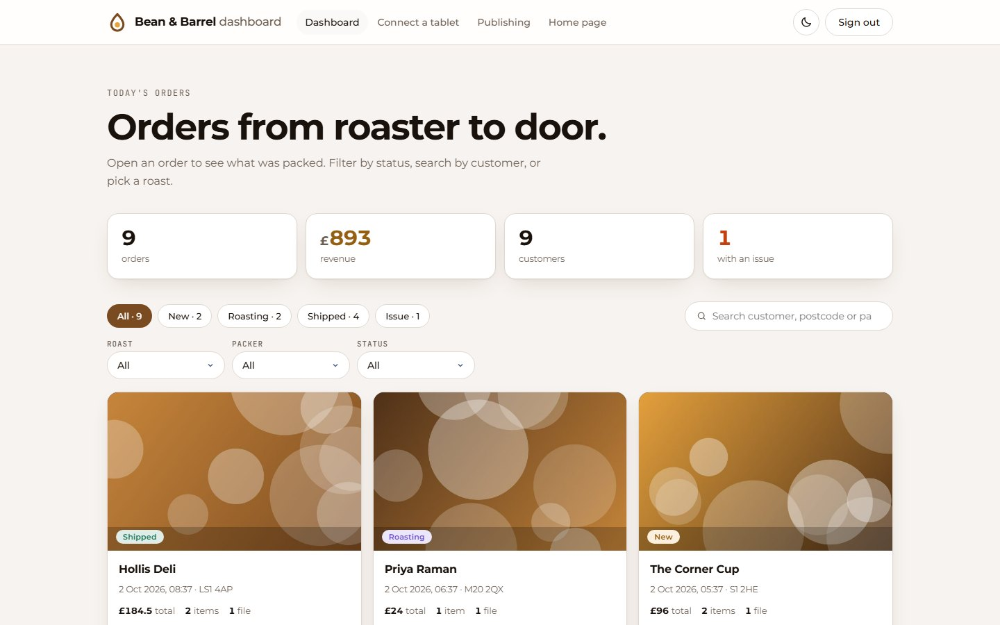<br><sub><b>Dashboard</b> · stat cards, status chips, search, facet filters, record cards</sub></td>
  </tr>
  <tr>
    <td>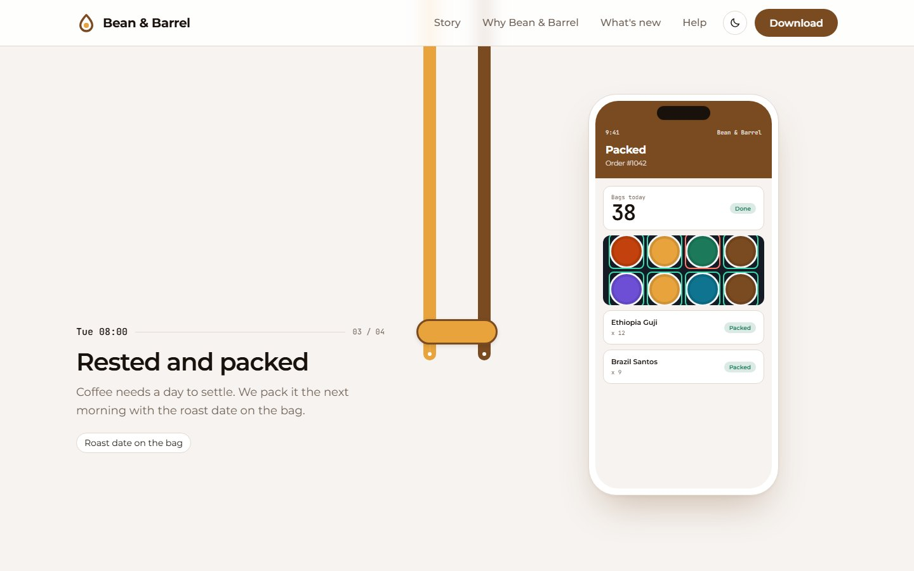<br><sub><b>Scroll story</b> · a phone mock-up that changes with each step</sub></td>
    <td>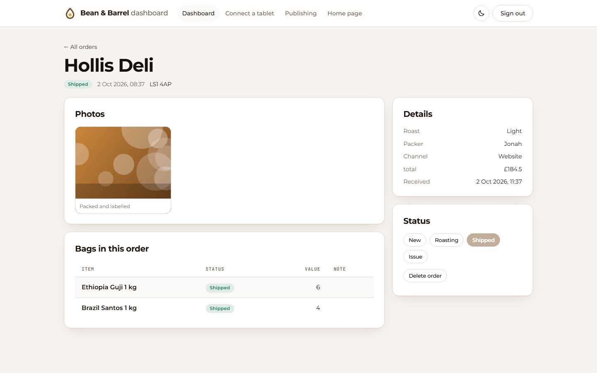<br><sub><b>Record detail</b> · facts, files, line items, one-click status changes</sub></td>
  </tr>
  <tr>
    <td>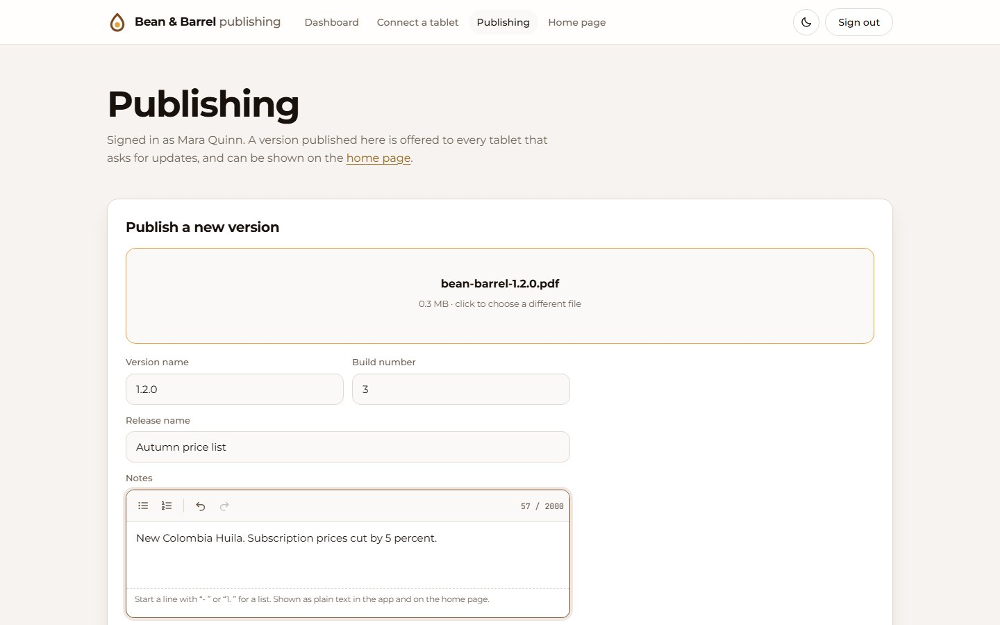<br><sub><b>Publishing</b> · drop a file, write notes, pick stable or testing</sub></td>
    <td>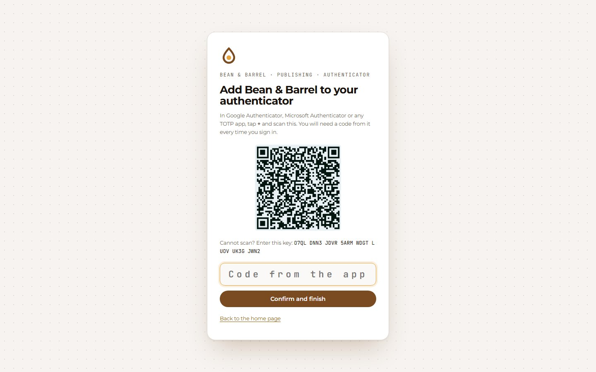<br><sub><b>MFA</b> · authenticator-app enrolment, invites, lockout, activity log</sub></td>
  </tr>
</table>

### On a phone

Every page is checked at 390 px and 360 px wide: no sideways scrolling, tables that scroll inside their card, filters in one swipeable row, controls at least 44 px tall on touch screens.

<p align="center">
  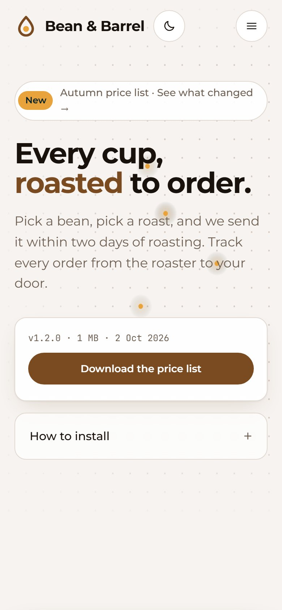
  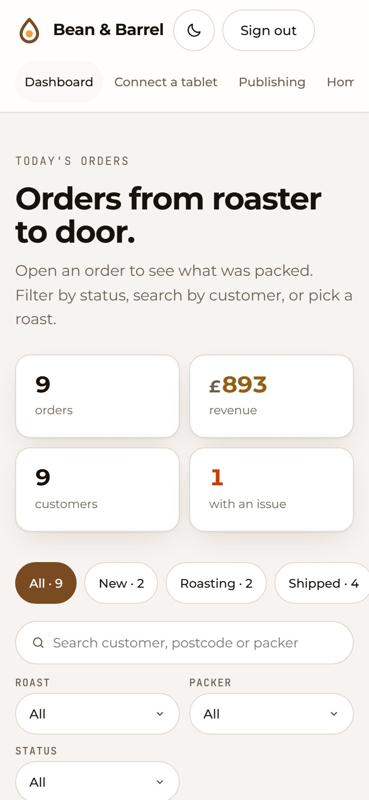
  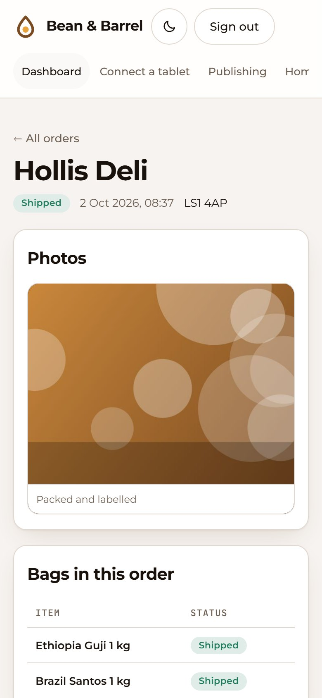
  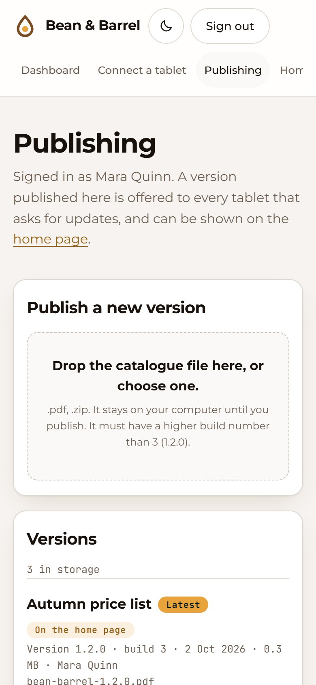
</p>

### Light and dark

Give it a primary and an accent colour. It derives the washes, the text colours (contrast-checked) and a lighter dark-mode variant. Dark follows the device, with a toggle in every header.

<p align="center">
  
  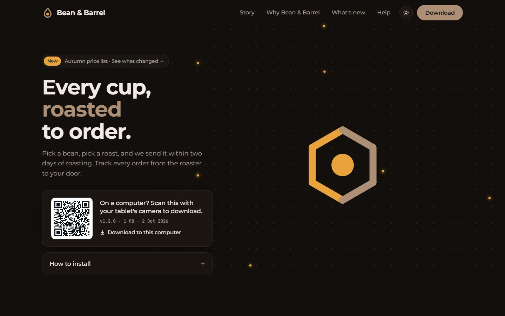
</p>

### One kit, any brand

<table>
  <tr>
    <td width="33%">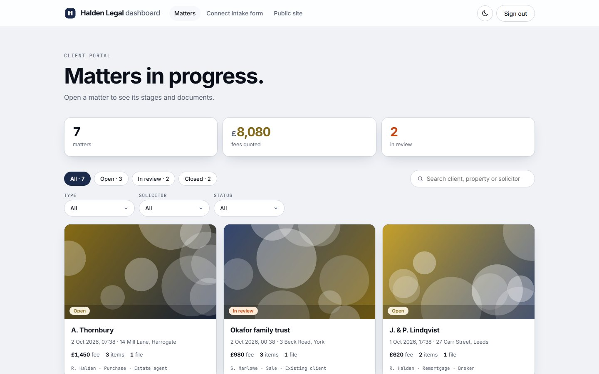<br><sub><b>Halden Legal</b> · matters, fees, stages</sub></td>
    <td width="33%">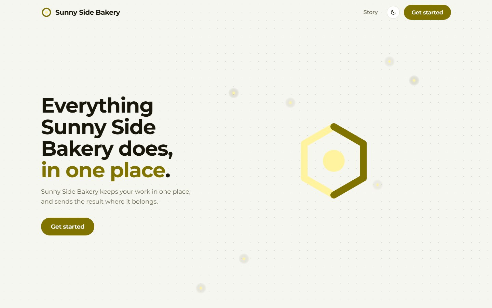<br><sub><b>Sunny Side Bakery</b> · a near-white brand colour, kept readable</sub></td>
    <td width="33%">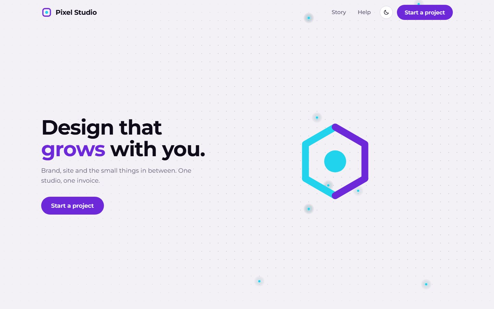<br><sub><b>Pixel Studio</b> · landing page + MFA team area</sub></td>
  </tr>
</table>

## Modules

Pick any combination. Dependencies are added for you (`publishing` brings `mfa`; `dashboard` and `connect` bring `signin` and the ingest API).

| Module | What you get | Needs |
| --- | --- | --- |
| `landing` | Public home page: animated mark, scroll story with phone mock-ups, proof numbers, features, FAQ, download card with QR code and team code, release list | none |
| `signin` | Shared-password gate in front of private pages: signed cookie, constant-time compare, safe `?next=` redirect, edge middleware | none |
| `mfa` | Named accounts with password and authenticator-app codes (TOTP), first-run setup, single-use invites, lockout, activity log | none |
| `publishing` | Upload versions, rich release notes, stable/testing channels, testers with codes, update-check endpoint, public download. Real APK parsing, or any file types you list | `mfa` |
| `dashboard` | Stat cards, filters, search, record cards, detail page with files, line items and status actions | `signin`, `api` |
| `connect` | A page with the link (address + key) to paste into your app, a copy button and a `curl` example | `signin`, `api` |

Internally there are two more: `base` (design system, database, storage) and `api` (ingest, signed uploads, file serving, health), added automatically when needed.

## Install

You need [Claude Code](https://claude.com/claude-code) and Node.js 20 or newer. A skill is a folder that Claude Code reads when a session starts, so installing means copying one folder.

### macOS / Linux

```bash
git clone https://github.com/raj742133/claude-site-kit
cd claude-site-kit
./install.sh
```

### Windows (PowerShell)

```powershell
git clone https://github.com/raj742133/claude-site-kit
cd claude-site-kit
.\install.ps1
```

If PowerShell blocks the script: `powershell -ExecutionPolicy Bypass -File .\install.ps1`

### Only for one project

Installs into `.claude/skills/` of the current folder, so you can commit it and share it with your team.

```bash
cd your-project
/path/to/claude-site-kit/install.sh --project          # macOS / Linux
C:\path\to\claude-site-kit\install.ps1 -Project         # Windows
```

### Manual

```bash
mkdir -p ~/.claude/skills
cp -R claude-site-kit/skill/site-kit ~/.claude/skills/
```

On Windows the target is `%USERPROFILE%\.claude\skills\site-kit`.

### Browser tests (once)

The verification step uses Playwright. Install it wherever you will run the verifier:

```bash
npm i playwright
npx playwright install chromium
```

### Check that it worked

- `~/.claude/skills/site-kit/SKILL.md` exists.
- Start a **new** Claude Code session and type `/site-kit`. The skill should appear in the list.

## Use it

Ask in plain words:

> Use site-kit to make a landing page and a dashboard for my business.

> I need a publishing page where my team uploads releases, with MFA sign-in.

> /site-kit

Claude will ask which modules you want, then your brand name, two colours, logo style and what you call things (orders, cases, scans). It writes a `site.json`, runs the generator, installs, builds, and runs the verifier. It reports what passed and what it could not check.

### Without Claude

The generator is plain Node. Even a brand name is enough:

```bash
echo '{"brand":{"name":"Acme Co"}}' > site.json
node ~/.claude/skills/site-kit/scripts/scaffold.mjs --config site.json --out ./my-site
cd my-site && npm install && npx next build && npm start
```

The generator prints the development password and ingest key it created (they are also in `.env.local`).

Then verify it:

```bash
node ~/.claude/skills/site-kit/scripts/verify.mjs --site ./my-site --port 4010 --out ./verify-shots
```

## Examples

Five complete configs ship in [`skill/site-kit/examples`](skill/site-kit/examples):

| Config | Brand | Modules | Shows |
| --- | --- | --- | --- |
| [`coffee.json`](skill/site-kit/examples/coffee.json) | Bean & Barrel | all six | PDF/ZIP publishing, testers, every landing section |
| [`fitness.json`](skill/site-kit/examples/fitness.json) | PulseFit | all six | Android APK publishing with real manifest parsing |
| [`legal.json`](skill/site-kit/examples/legal.json) | Halden Legal | landing, sign-in, dashboard, connect | monogram logo, navy and gold, "matters" vocabulary |
| [`studio.json`](skill/site-kit/examples/studio.json) | Pixel Studio | landing, MFA | square logo, purple and cyan |
| [`minimal.json`](skill/site-kit/examples/minimal.json) | Acme Co | defaults | a brand name and nothing else |

The full list of config keys is in [`reference/config.md`](skill/site-kit/reference/config.md).

## What you get under the hood

- **Layered sign-in.** A shared-password cookie, named MFA accounts, a bearer ingest token and per-tester codes. They are four separate layers and are never merged.
- **Direct-to-storage uploads.** Clients get short-lived signed URLs and PUT files straight to storage. Local disk, S3 / R2 or Azure Blob.
- **Idempotent ingest.** Re-sending a record id updates it instead of duplicating it, so a phone that retries after losing signal does no harm.
- **Postgres with zero setup.** Embedded Postgres ([PGlite](https://pglite.dev)) out of the box; set `DATABASE_URL` for production.
- **Secure defaults.** Scrypt password hashes, HMAC-signed cookies, constant-time compares, authenticator codes that cannot be reused, lockout after five failures, user text sanitised before it reaches source files.
- **Your vocabulary.** Call a record an order, a matter or a loaf, and every label, heading and empty state follows.
- **No invented facts.** Sections that need real numbers (proof, features, compatibility) stay off until you supply them.

## How it is tested

Each example was scaffolded from its config, type-checked, built for production and driven with Playwright in Chromium at 1280, 390 and 360 px. Checks include sign-in and open-redirect refusal, full MFA enrolment with an independent TOTP implementation, replay refusal, single-use invites, publishing with build-number ordering and byte-identical downloads, ingest auth and idempotency, filters, no horizontal scroll, finger-sized controls, repeated warm-cache loads of every page type for hydration errors, and console errors.

| Site | What it exercises | Result |
| --- | --- | --- |
| Bean & Barrel | all six modules, PDF/ZIP publishing, testers | 87/87 |
| PulseFit | all six modules, two real Android APKs parsed and published | 77/77 |
| Halden Legal | landing, sign-in, dashboard, connect; monogram logo, navy and gold | 60/60 |
| Pixel Studio | landing and MFA only | 34/34 |
| Sunny Side Bakery | near-white brand colours (contrast adjustment) | 49/49 |
| Midnight Courier | near-black brand colours, other fonts, PDF/CSV publishing | 45/45 |
| Quotes, tags, braces | a brand name full of `"`, `<b>`, `{x}`, backticks and a backslash | 57/57 |
| Orbit Labs | a single module: landing only | 12/12 |
| Field Notes Press | a single module: publishing only (brings MFA and the API) | 24/24 |
| Acme Co | just a brand name, everything else defaulted | 75/75 |

Ten sites, 520 checks, all passing on the final templates.

Details of every check are in [`reference/testing.md`](skill/site-kit/reference/testing.md).

### Not covered

- `next dev` crashed with PGlite on the Node versions tried (24.18 and 22.23), so only production builds are tested.
- Real phones, Safari, Firefox and tablets. Only Chromium at three widths.
- S3 and Azure storage against a real bucket, and a real Postgres server.
- Brand names longer than about 24 characters in the phone header.
- The authentication code follows common practice but has not had an independent security audit. Review it before putting anything sensitive behind it.

## Repository layout

```text
skill/site-kit/        the skill: SKILL.md, scripts, templates, examples, reference docs
  scripts/             scaffold.mjs (generator), verify.mjs (browser verifier), modules.mjs, defaults.mjs
  templates/           base + one folder per module, mirroring the generated project
  examples/            five complete configs
  reference/           config keys, modules, design system, testing, gotchas
site/                  the website (static HTML/CSS/JS), deployed on Vercel
tools/                 how the screenshots, banner and social image were made
install.sh, install.ps1
```

To regenerate the screenshots: build the example sites, then run `tools/showcase.mjs` for each (see the header of that file).

## Contributing

Issues and pull requests are welcome. A new module is a folder under `skill/site-kit/templates/modules/<id>/` that mirrors the output tree, plus an entry in `scripts/modules.mjs`. Please run the verifier on at least one generated site before opening a pull request, and say which sites you ran.

## Licence

[MIT](LICENSE)
